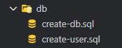

# follow-app

## Setup

### Database

1. Run **.sql** files ahead:

    

2. Enter on src directory by terminal and run:

to instal node dependences
~~~shell
npm i
~~~

to run server
~~~shell
npm start
~~~

3. Open **localhost:3000** on browser and enjoy it!

~~~shell
http://localhost:3000/
~~~